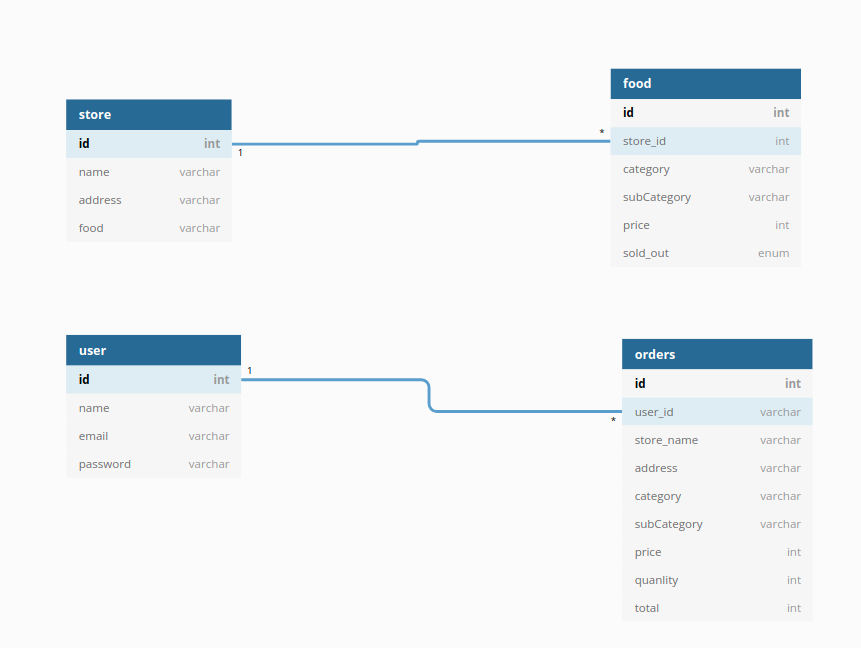
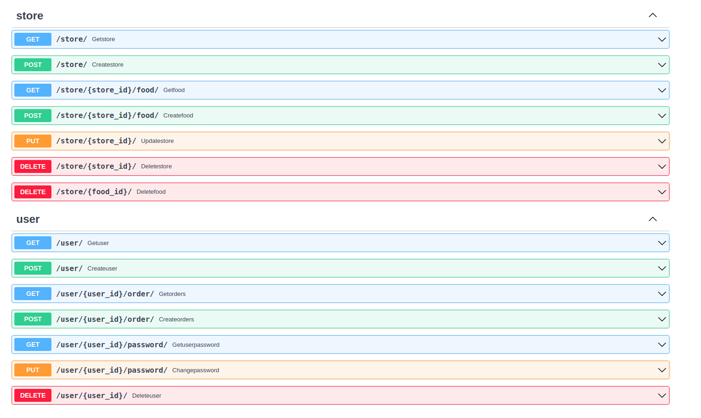
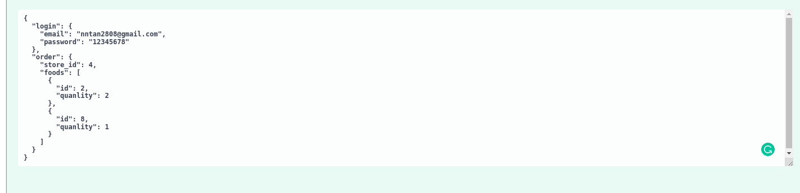
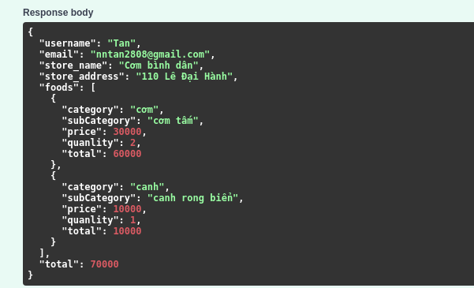

# About
Building a Launch Ordering Webapp with FastAPI

# Technology
- API: FastAPI
- Database: Postgres
- Language: Python 3

# Schemas
- **store** one to many with **food**
- **user** one to many with **order**

Note: Because I think the **order** is unchangeable, so I didn't create relationship between **order** with **store** and **food**. For example if we change the **store address** the **order address** history will be change too.



# Installation
```
git clone https://github.com/Ton2808/SimpleLunchApp.git
cd SimpleLunchApp
pip install requirements.txt
uvicorn main:app --reload
```

# Demo
## Here is the docs


## A user order multiple foods in a store




